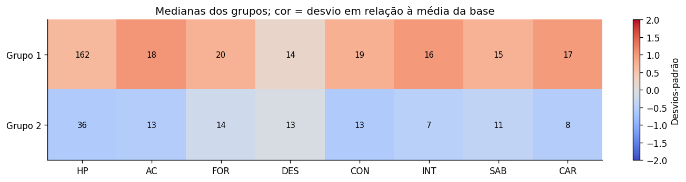
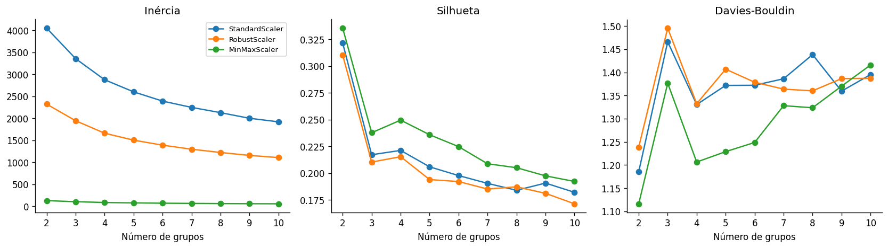
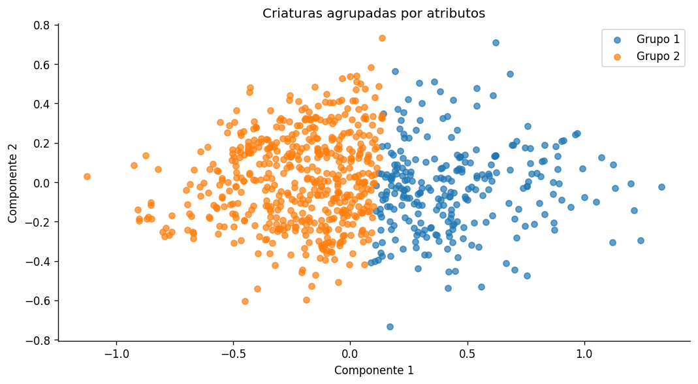

# Criaturas de D&D: agrupamento por semelhança

Gosto de RPGs e escolhi usar um bestiário de Dungeons & Dragons para estudar machine learning. A pergunta do projeto é: **quais criaturas têm perfis semelhantes de atributos, pontos de vida e defesa?**

A análise usa K-Means para agrupar criaturas e inclui uma consulta que encontra monstros parecidos nas características selecionadas. A ideia é explorar o bestiário e procurar alternativas para um RPG. A semelhança calculada não garante que duas criaturas tenham a mesma dificuldade em combate.

## O que tem neste projeto

- Preparação e conferência dos três datasets.
- Análise de HP, classe de armadura, atributos, tipos e CR.
- Comparação de três escalonadores e de dois a dez grupos.
- Avaliação por silhueta, Davies-Bouldin, inércia e tamanho dos grupos.
- Verificação de estabilidade com outras sementes, retirada de HP e agrupamento hierárquico.
- Comparação de registros entre AideDD e 5eTools e análise separada das versões legacy.
- Consulta de criaturas semelhantes e explicação dos resultados no notebook.

## Dados

| Arquivo | Registros | Uso |
|---|---:|---|
| `5e_monster_data_aidedd.csv` | 791 | Base principal do modelo. |
| `5e_monster_data_5eTools.csv` | 2.947 | Conferência entre fontes. |
| `5e_superceeded_monster_data_aidedd.csv` | 248 | Análise das versões legacy. |

Os três CSVs foram recebidos para o projeto e preservados. Eles não são concatenados no treinamento, para evitar misturar versões e repetir criaturas. Os nomes dos arquivos indicam as fontes; a página exata de publicação, a data de extração e a licença desse conjunto recebido ainda não foram informadas.

## Como o modelo funciona

O modelo usa força, destreza, constituição, inteligência, sabedoria, carisma, classe de armadura e pontos de vida. HP recebe a transformação `log1p` para reduzir a influência de valores muito altos.

Nome, tipo, tamanho, CR e movimento ficam fora do treinamento. Eles ajudam a interpretar os grupos depois. A tarefa é de aprendizado não supervisionado: não existe uma coluna com o grupo correto que o modelo deve aprender a prever.

São testados StandardScaler, RobustScaler e MinMaxScaler. A regra escolhe a maior silhueta entre soluções sem grupos de uma única criatura. Davies-Bouldin, inércia e tamanhos são usados como conferências complementares. Comparar escalonadores é uma avaliação exploratória, pois cada um muda as distâncias.

## Resultados

A execução incluída selecionou **MinMaxScaler e dois grupos**, com silhueta de **0,336** e Davies-Bouldin de **1,116**.

| Indicador mediano | Grupo 1 | Grupo 2 |
|---|---:|---:|
| Criaturas no grupo | 263 | 528 |
| HP | 162 | 36 |
| Classe de armadura | 18 | 13 |
| Força | 20 | 14 |
| Inteligência | 16 | 7 |
| CR, usado somente na interpretação | 12 | 2 |

A divisão é ampla e acompanha diferenças de atributos e defesa. Não chamei os grupos de tanques ou conjuradores, porque ataques e habilidades especiais não entraram no modelo. Os números dos grupos são apenas identificadores.



Nas dez sementes testadas, o ARI foi 1: a divisão se manteve. Ao retirar HP, o ARI em relação ao modelo principal foi 0,934. Com agrupamento hierárquico Ward, foi 0,677. Isso mostra que mudar o algoritmo teve mais efeito que retirar HP neste teste.

Há duas criaturas com silhueta individual negativa. O resultado não tem a mesma separação para todos os registros.



A PCA é usada apenas para visualizar os grupos em dois eixos. O treinamento usa as oito variáveis.



## Como executar

Use Python 3.12, a versão usada na verificação do projeto.

```bash
git clone https://github.com/azenhasoft/dnd-monster-clustering.git
cd dnd-monster-clustering
python -m venv .venv
```

Ative o ambiente no seu sistema.

**Windows, PowerShell:**

```powershell
.venv\Scripts\Activate.ps1
```

**Linux ou macOS:**

```bash
source .venv/bin/activate
```

Instale as dependências e abra o JupyterLab:

```bash
python -m pip install -r requirements.txt
python -m jupyterlab
```

Abra `projeto_dnd.ipynb` e execute as células na ordem. Mantenha os três CSVs na mesma pasta do notebook. Também é possível usar o VS Code com suporte a notebooks.

O notebook contém as tabelas e os gráficos da execução, então é possível acompanhar a análise sem rodá-la primeiro.

## Consulta de criaturas semelhantes

Depois de executar as células de preparação e modelagem, use a função definida no notebook:

```python
semelhantes("Aboleth", quantidade=5)
```

Troque o nome por uma criatura da base principal. O resultado mostra as mais próximas nas oito variáveis escalonadas, considerando toda a base. A distância não usa o CR nem o nome.

## Limitações

A consulta não é uma calculadora de equilíbrio de encontros. Dano, magias, resistências, imunidades e ações especiais não foram analisados. Algumas variáveis são correlacionadas, e isso influencia a distância entre criaturas.

Os resultados dependem dos arquivos, das variáveis e do método escolhido. A silhueta é uma avaliação interna. Estabilidade entre sementes não demonstra que a divisão se manterá em outras bases.

As correspondências entre fontes usam nomes padronizados e deixam nomes ambíguos de fora. Diferenças entre registros não são tratadas como mudanças oficiais de regras.

## Próximos passos

Quero explorar características de combate e avaliar a consulta com exemplos de encontros. Outra possibilidade é usar essa análise como ponto de partida para uma ferramenta de consulta nos meus projetos de RPG.

**Autor:** Lucas Azenha.
